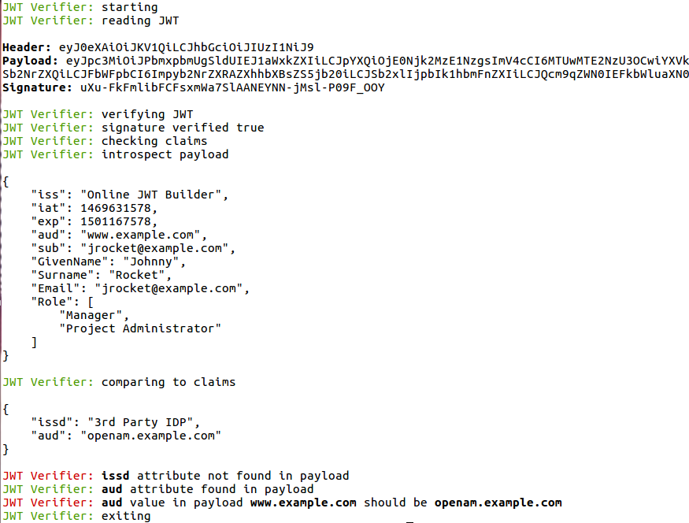

<b>Node JWT Verifier</b>
 
 
A basic JSON Web Token (JWT) verifier, decoder and claims checker for the command line, based on the jsonwebtoken library.
 
 
<b>Installation</b>
 
 
This app is written in node.js, so node.js will need to be download and configured for your operating system. Once installed, clone 
the node-jwt-verifier project locally. Run "npm install" from within this project directory to install dependencies
 from the package.json file.
 
 
<b>Usage</b>
 
 
Edit the SignatureVerifier file to contain either the HMACSharedSecret or RSAPublicKey for signature verification.  Add any claims to be checked in the claims file as a JSON object.
 
To run enter <b>node app.js JWT</b> where JWT is the dot-delimited base64 encoded JWT token.
 
 
 
Based on https://github.com/auth0/node-jsonwebtoken
 
Use as-is no warranty.
 
 
NB - jwkConverter.js is a pre-processing utility that converts the JWK often found via the jwk_uri in OIDC deployments to an RS/EC cert
that can be used in the signature verification process.  A wrapper for jwk-to-pem.npm.
 
 

